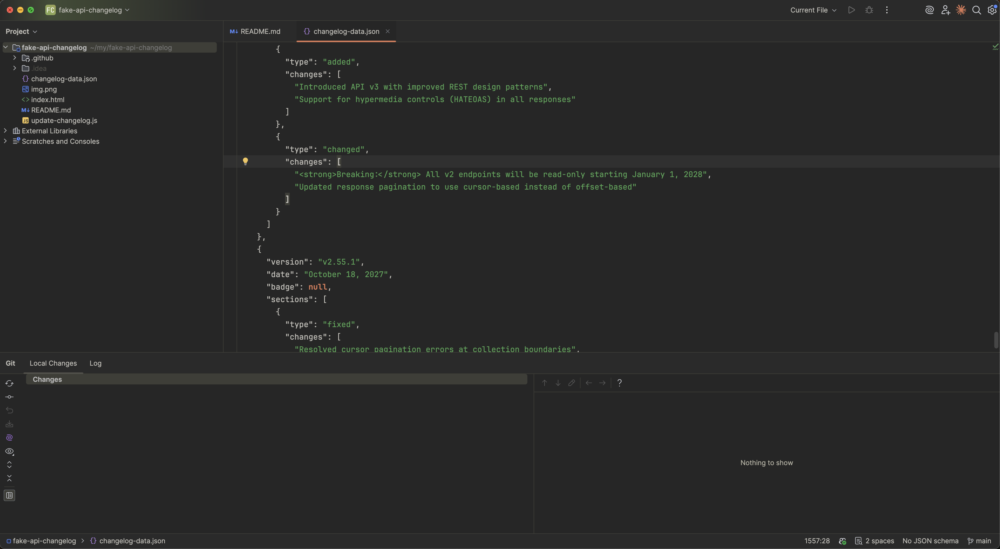
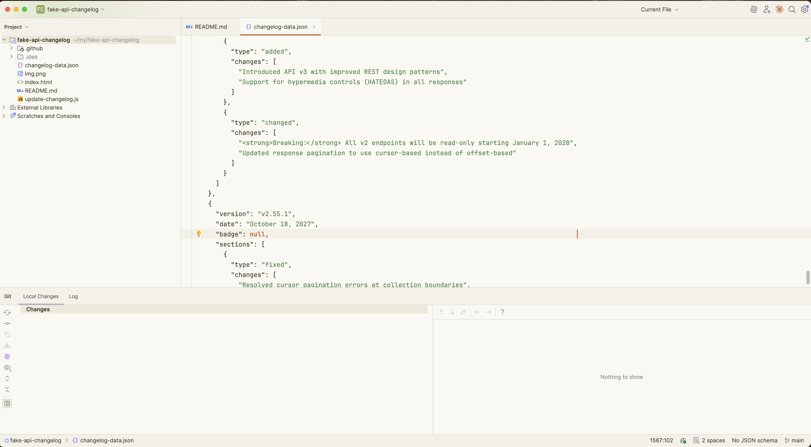

# Claude Theme for IntelliJ IDEA

A warm, refined color theme inspired by Claude. Dark and light variants.

## Screenshots

### Dark



### Light



## Structure

The `.icls` files in the repo root (`claude-dark-intellij.icls`, `claude-light-intellij.icls`) are standalone editor color schemes (syntax highlighting, editor colors, console colors). They can be imported directly via Settings → Editor → Color Scheme → gear icon → Import Scheme.

The plugin builds on top of these by adding a full UI theme (`.theme.json`) that styles the rest of the IDE — toolbars, tabs, panels, trees, popups, buttons, status bar, icons, etc.

## Installation

### From Disk
1. Download the latest release zip
2. IntelliJ IDEA → Settings → Plugins → gear icon → Install Plugin from Disk
3. Settings → Appearance → Theme → select Claude Dark or Claude Light

### Build from Source
```bash
JAVA_HOME=/path/to/jdk17 ./gradlew buildPlugin
```
Output: `build/distributions/claude-intellij-theme-*.zip`
